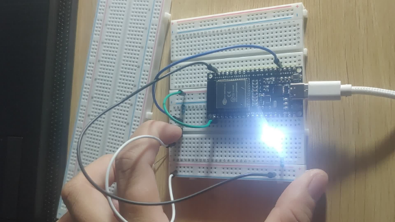

## 🛠️ Kiểm tra ESP32

```c
// Khai báo các thư viện cần sử dụng
#include <Arduino.h>

// Chân kết nối nút nhấn và LED
const int buttonPin = 15; // Chân nút nhấn kết nối với GPIO 15
const int ledPin = 13; // Chân LED kết nối với GPIO 13

// Biến để lưu trạng thái trước và sau của nút nhấn
int buttonState = 0;
int lastButtonState = 0;

void setup() {
// Khai báo chân làm INPUT_PULLUP để sử dụng nút nhấn
pinMode(buttonPin, INPUT_PULLUP);
// Khai báo chân làm OUTPUT để sử dụng LED
pinMode(ledPin, OUTPUT);
}

void loop() {
// Đọc trạng thái của nút nhấn
buttonState = digitalRead(buttonPin);

// Kiểm tra xem trạng thái của nút nhấn có thay đổi không
if (buttonState != lastButtonState) {
// Nếu có thay đổi, kiểm tra nếu nút nhấn đang được nhấn xuống (LOW)
if (buttonState == LOW) {
// Bật đèn LED
digitalWrite(ledPin, HIGH);
} else {
// Tắt đèn LED
digitalWrite(ledPin, LOW);
}
}
// Lưu trạng thái hiện tại của nút nhấn để so sánh ở vòng lặp tiếp theo
lastButtonState = buttonState;
}
```

**Kết Quả:**



Từ hình ảnh trên, kết quả ESP32 hoạt động tốt

