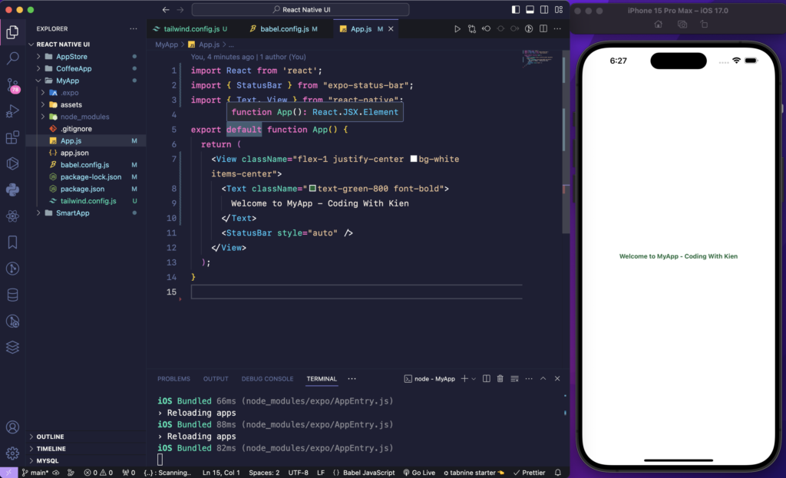

## 🖌️ React Native CLI

[Hướng dẫn cài đặt React Native](https://codingkienlab.tech/create-mobile-app-with-react-native-and-tailwindcss/)

#### Cài Đặt Trên Window

<iframe width="766" height="543" src="https://www.youtube.com/embed/5jdR8MC6q6s?list=PLv6GftO355AtasIvXXJNXIs_H6v9KSUXC" title="Lập trình di động với React Native - 04 Cài đặt - P04 Window" frameborder="0" allow="accelerometer; autoplay; clipboard-write; encrypted-media; gyroscope; picture-in-picture; web-share" referrerpolicy="strict-origin-when-cross-origin" allowfullscreen></iframe>

#### Cài Đặt Trên macOS

<iframe width="766" height="543" src="https://www.youtube.com/embed/I1DRPlstUAE?list=PLv6GftO355AtasIvXXJNXIs_H6v9KSUXC" title="Lập trình di động với React Native - 03 Cài đặt - P03 MacOS" frameborder="0" allow="accelerometer; autoplay; clipboard-write; encrypted-media; gyroscope; picture-in-picture; web-share" referrerpolicy="strict-origin-when-cross-origin" allowfullscreen></iframe>

#### Hướng Dẫn

Bước đầu tiên là thiết lập môi trường phát triển của bạn. Đảm bảo bạn đã cài đặt Node.js và npm trên máy của mình. Khi đã xong, hãy tạo một dự án React Native mới bằng các lệnh sau:

```javascript
# Create a new Expo project named "MyMobileApp" using the Expo CLI.
npx create-expo-app MyMobileApp

# Change the current directory to the newly created project directory.
cd MyMobileApp
```

Cài đặt phụ thuộc

Để thiết lập dự án của bạn với cả hai nativewind và tailwindcss, bạn sẽ cần cài đặt chúng dưới dạng phụ thuộc. Vì tailwindcsschỉ được sử dụng trong quá trình phát triển nên nó có thể được thêm vào dưới dạng phần phụ thuộc phát triển. Đây là cách bạn có thể viết lại hướng dẫn:

```javascript
# Install nativewind as a regular dependency
npm install nativewind

# Install tailwindcss as a development dependency
npm install --save-dev tailwindcss
```

Cấu hình CSS Tailwind

CSS Tailwind cần một số cấu hình ban đầu. Tạo một `tailwind.config.js` tệp trong thư mục gốc của dự án và định cấu hình CSS Tailwind:

```javascript
npx tailwindcss init
```

Trong `tailwind.config.js` tệp của bạn, hãy bao gồm các đường dẫn đến tất cả các tệp thành phần của bạn. Thay thế <src >bằng tên thực của thư mục của bạn, chẳng hạn như screens. Đây là cách bạn có thể diễn đạt nó:

```javascript
module.exports = {
  content: ["./App.{js, jsx, ts, tsx}", "./<src>/**/*.{js,jsx,ts,tsx}"],
  theme: {
    extend: {},
  },
  plugins: [],
};
```

Cấu hình Babel
Mở và thay đổi babel.config.js của bạn:

```javascript
module.exports = function (api) {
  api.cache(true);
  return {
    presets: ["babel-preset-expo"],
    plugins: ["nativewind/babel"],
  };
};
```

Bắt đầu viết code React Native và TailwindCSS
Mở file App.js và sửa code:

```reactnative
import React from "react";
import { StatusBar } from "expo-status-bar";
import { Text, View } from "react-native";

export default function App() {
  return (
    <View className="flex-1 justify-center bg-white items-center">
      <Text className="text-green-800 font-bold">
        Welcome to MyApp - Coding With Kien
      </Text>
      <StatusBar style="auto" />
    </View>
  );
}
```

Chạy ứng dụng MyMobile
Để chạy dự án của bạn, hãy điều hướng đến thư mục và chạy một trong các lệnh npm sau.

```javascript
npm run ios
```

Sau khi chạy thì sẽ hiển thị ra giao diện sau:

